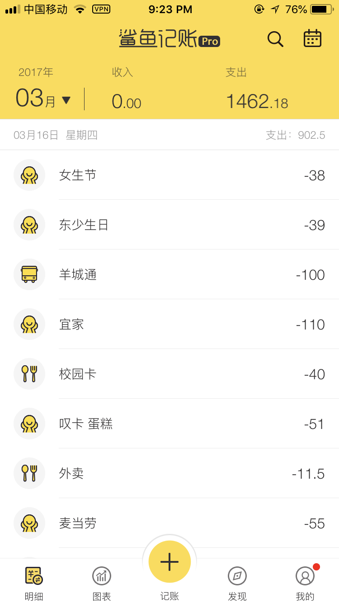
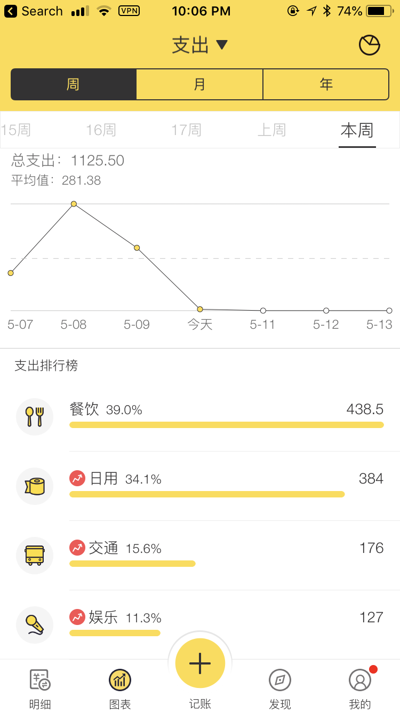
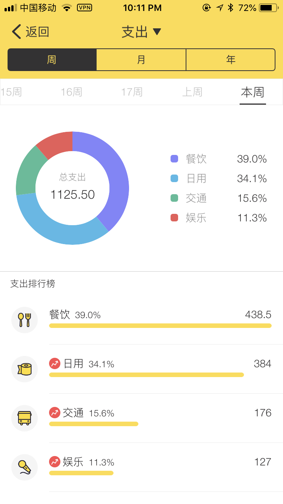
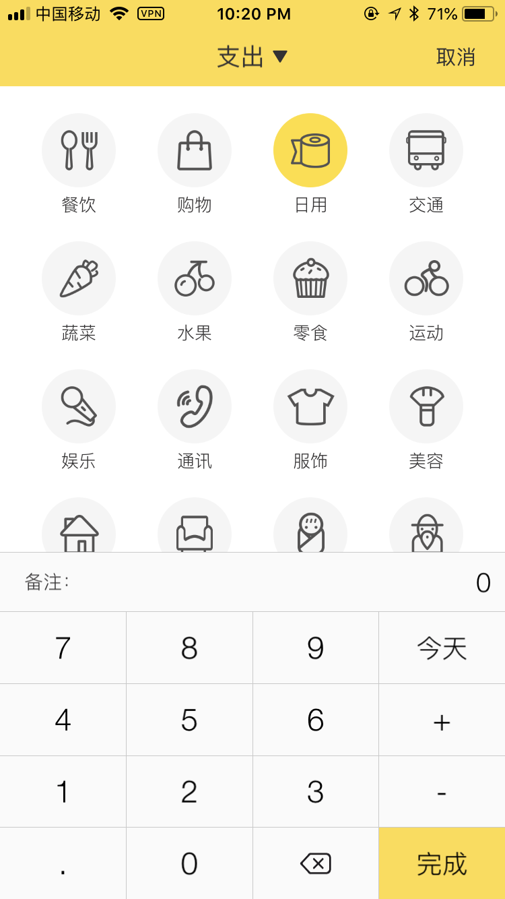

# 期中练习
{:.no_toc}

* 目录
{:toc}

## 鲨鱼记账APP
鲨鱼记账是一款专业的生活记账软件,极简的的操作流程,让你轻松上手,三秒钟即可完成记账,极速体验。

### 明细页
-  明细页显示了当前月份的**账单明细**
-  显示了当前的**月份**、**月收入**和**月支出**
-  明显按照天为单位，每一天包含**日期**和**星期**，以及当天的**收入**和**支出**总额
-  每一条明细包含**类型**、**具体的名称**和**金额**

### 图表页
- 图表页主要可以**可视化查看**用户的**账本**
- 首先通过**切换**顶部的【支出/收入】可以单独查看收入和支出的图表
- 提供三种**时间维度**（周/月/年）来统计用户的账本，下方可以随意**切换**对应维度下的**时间段**
- 提供的图表主要包含**折线图**、**类别排行榜**、**饼状图**

### 记账页
- 记账页用于记录**新增的账目**
- 首先可以**切换**账目为【收入/支出】
- 然后**选择**账目的**类别**
- 可以**备注**账目的具体**名字**
- 可以**更改**账目产生的**日期**，默认【今天】
- 可以使用键盘**输入数字**或者**简单的公式**来**记录金额**

### 其他
其他页面包括【发现】和【我的】因为功能比较繁杂，考虑到作业的完成时间，省略这些页面。