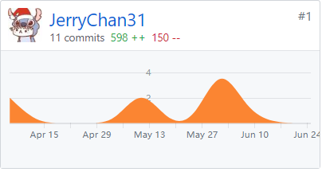

# Final Report
## 课程学习自我总结
1. 需求分析阶段往往能提出许多用例，但更重要的是分辨出用例的重要性次序。
2. 领域模型设计十分、非常重要，一旦出现问题修改起来相当麻烦。但只有实践中才能知道是否正确。
3. 规范的工作流程和合适的工具可以大大提高协作开发的效率。
4. 我觉得课程过程中最大的收获并不是技术上得到什么提升，而是学习到了团队协作的一整套流程和方法。
5. 感谢 Michael Chan ，他的开发经验在技术选型、工具选择、工作流程等方面给小组提供了相当大的帮助。

## PSP 2.1 统计表

|PSP 2.1|Time Spent(h)|
|-------|-------|
|**Planning**|**2.5**|
| - Estimate | 2.5 |
|**Development**| **63.2** |
| - analysis| 3.4 |
| - Design Spec| 2.8 |
| - Design Review| 2.2 |
| - Coding Standard| 1.7 |
| - Design| 5.6 |
| - Coding| 20.2 |
| - Code review| 4.0 |
| - Test| 23.3 |
|**Reporting**| **3.5** |
| - Test Report| 1.8 |
| - Size Measurement| 1.1 |
| - Postmortem & Process Improvement Plan| 1.6 |

## 个人分支的 GIT 统计报告

## 得意/有价值/有苦劳的工作清单
 - 参与了需求分析阶段的盲测，提出产品的功能模块按旅行前辅助计划/旅行中辅助出行/旅行后分享经历的方式划分，这个建议最终也被产品经理采纳了。
 - 设计的数据库表基本没有改动。
 - 实现了几个逻辑比较复杂的接口。

## 个人的技术类、项目管理类博客清单
[前后端分离&接口API设计学习报告](https://www.cnblogs.com/JerryChan31/p/8809440.html)
