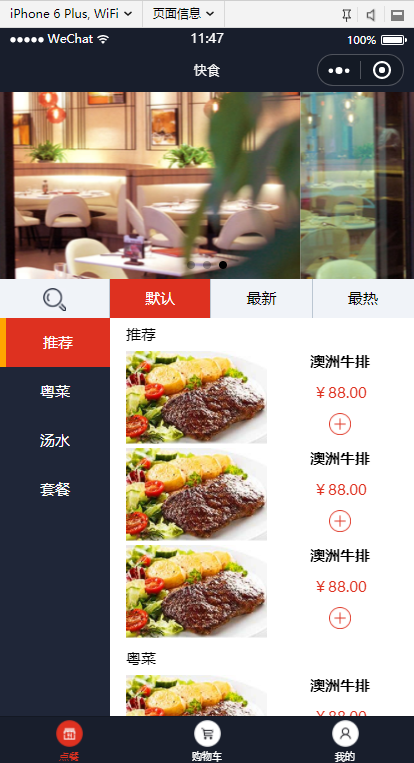
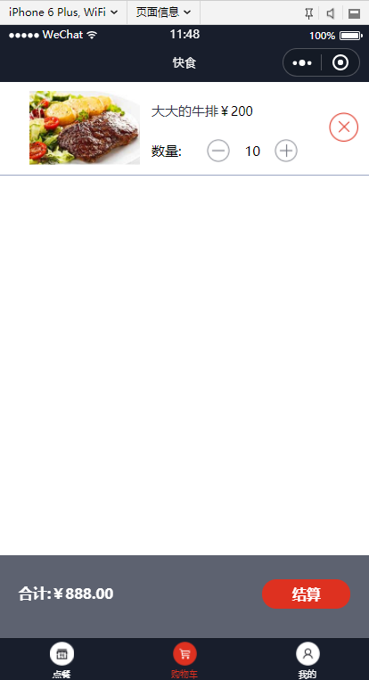
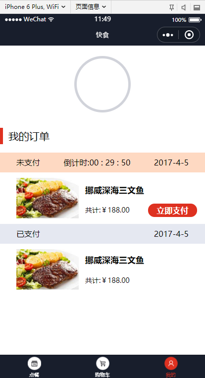

# 7.1 UI Design

#### 主要的设计思路如下所示：

逻辑上按照现有常见的点餐小程序设计思路，对菜品进行分类。底部总共有三个功能区按钮，分别是

| **功能区** |                             内容                             |
| :--------: | :----------------------------------------------------------: |
|   ① 点餐   | 当前区域显示菜单：左侧是品类菜单，右侧为详细菜单信息。用户可以根据自己的喜好进行点餐操作，加入购物车 |
|  ② 购物车  |     显示用户已选择的食物，并显示总的价格，以及付款的按钮     |
|   ③ 我的   |                      显示用户的历史订单                      |

小程序主页面如下图所示：

具体的操作步骤如下：

1. 主页面中，从左侧菜单栏选择菜单的大类

2. 选择当前大类下的菜品，加入购物车

3. 切换分类继续选择

4. 进入购物车结算

------

------

#### 其他的主页面信息如下所示：

① 购物车页面

② 我的页面

