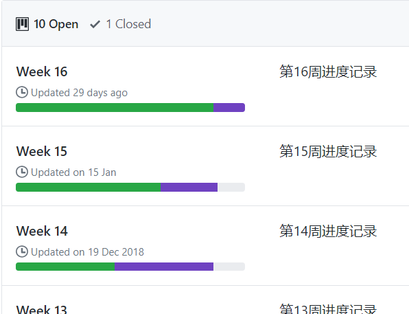
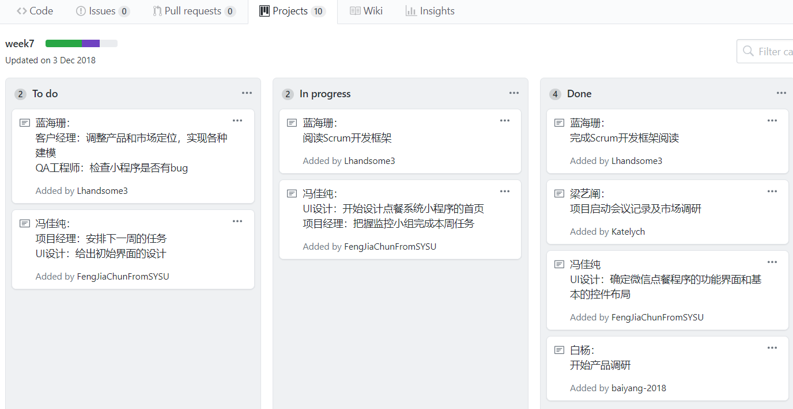

# 看板
{:.no_toc}

* 目录
{:toc}

## 1、看板使用指南

看板是作业评分的重要依据，你必须每周或每两周维护一个看板。

使用看板管理项目的工具很多，如 github project，[TAPD](https://www.tapd.cn/)，tower ... [Taiga](https://taiga.io/)，[atteam](https://www.atteam.cn/sign/Index.aspx) 等。对于软件项目，我们一般关注以下方面的支持：

* Scrum 
* KANBAN
* Bug tracing

作为课程，你必须维护一个 **在线可访问** 的看板列表，以下以 Github 为例：

例如：

每个看板可以是标准格式，也可以是你喜欢的其他格式

## 2、评分指南

* 看板持续性
* 任务粒度合理性
* 任务分配均衡性
* 完成情况合理性
    - 完成率一般会谁时间越来越高（表示任务估算能力提升）
    - 每次 100% 完成一定是造假

## 参考案例

1. [project KANBAN](https://github.com/2018SystemAnalysis/Wechat-Odering-System/projects)

