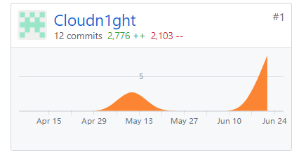

# Final Report

------
## 课程学习自我总结
1. 在课程的学习过程中，我学会了使用UMLet绘图工具完成一些系统设计图（比如说时序图，用例图，树形图），并且对一些已有的项目进行项目分析，借鉴其中的内容，应用到我们自己的开发项目之中。
2. 通过各种设计模式与模型的学习（例如MVC(Model-View-Controller)软件设计模式、BCE(Boundary-Controller-Entity)设计模型）我知道了各个项目之间的构造与相互关联的方式。
3. 在这门课程中，我也了解了一些以前从未了解过的后端语言PHP，并且明白了一个后端所需要协作的一些开发相关。
4. 使用teambition来进行工作的认领，完成记录的工作，在github创建了一个仓库来协作开发，学会了git的操作，知道了如何进行协助开发，并且学会了在阿里云服务器上搭建mySQL数据库以及php语言环境，以及七牛云服务器上进行图片服务器的搭建。
5. 学会了根据前端的需求设计API与返回的数据，实现前后端同时开发。因为这次我们使用了apizza这个的api设计管理工具，前后端可以通过这个api设计工具及时交互，通过mock来让前端提前实现一些后端未完成的功能。
6. 最后要感谢zscd0218与JerryChan31同学作为同是后端小组的成员给予的帮助。同时要感谢mcmicahelchan作为项目经理对整个项目的卓越贡献，他拥有的开发经验让我们在前期开发所选用工具上减少了许多的弯路。

## PSP 2.1 统计表

|PSP 2.1|Time Spent(h)|
|-------|-------|
|**Planning**|**2**|
| - Estimate | 2 |
|**Development**| **66** |
| - analysis| 6 |
| - Design Spec| 2 |
| - Design Review| 1 |
| - Coding Standard| 1 |
| - Design| 10 |
| - Coding| 24 |
| - Code review| 4 |
| - Test| 18 |
|**Reporting**| **5** |
| - Test Report| 1 |
| - Size Measurement| 2 |
| - Postmortem & Process Improvement Plan| 2 |
| - total| 73 |

## 个人分支的 GIT 统计报告

## 得意/有价值/有苦劳的工作清单
 - 主要负责阿里云服务器的搭建，在上面搭建有关于开发PHP，SQL的环境，建立shell的公钥私钥保证文件的正常传输。
 - 负责图片服务器的搭建，负责管理团队的bucket，学习了获取凭证上传等的操作，保证整个APP的图片的使用。
 - 主要负责设计数据库的工作，参与所有数据库表单的构建工作。并负责对数据库内容进行添加。
 - 参与有关于项目大部分的API设计，并负责对API的功能进行测试。

## 个人的技术类、项目管理类博客清单
[PHP学习心得](https://blog.csdn.net/weixin_36942958/article/details/79922310)