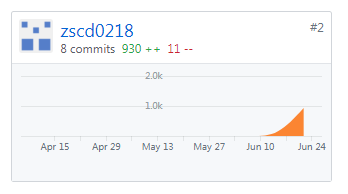

# Final Report

------
## 课程学习自我总结
1. 通过一个学习的课程的学习，我逐渐学习了解到了许多有关软件开发的系统分析与设计的过程与知识。首先我学会了使用UMLet绘图工具绘制相关的各种UML图，例如用例图、时序图、类图、对象图、状态图等。除此之外我还学习了各种设计模式与模型，例如MVC(Model-View-Controller)软件设计模式、BCE(Boundary-Controller-Entity)设计模型。
2. 这次大作业我被推举为后端小组长，来负责我们这个项目的后端api分工与相应设计与实现。由于我们后端小组三人是首次接触后端，所以经过我们的讨论与比较，我们最终选择了简单易学并且功能也全面的php作为我们的后端语言。
3. 使用teambition来进行相关工作分工，在github创建了一个仓库来协作开发，并且学会了在云服务器上搭建mySQL数据库以及php语言环境。
4. 学会通过前端所给的相应需求与流程图抽象设计出相应的api接口，并与前端小组进行沟通予以完善。
5. 使用了apizza这个的api设计管理工具来帮助我们更好的与前端合作，因为我们只需写好文档，前端就可以在我们还未实现api的时候就先使用mock来先实现前端，这样就能很好的前后端分离。
6. 最后要感谢mcmicahelchan与JerryChan31同学对我第一次接触后端给予了非常多的帮助，使我受益匪浅。

## PSP 2.1 统计表

|PSP 2.1|Time Spent(h)|
|-------|-------|
|**Planning**|**3.5**|
| - Estimate | 3.5 |
|**Development**| **78.6** |
| - analysis| 2.4 |
| - Design Spec| 2.4 |
| - Design Review| 2.0 |
| - Coding Standard| 2.0 |
| - Design| 7.5 |
| - Coding| 25.0 |
| - Code review| 5.0 |
| - Test| 32.3 |
|**Reporting**| **4.8** |
| - Test Report| 2.0 |
| - Size Measurement| 1.2 |
| - Postmortem & Process Improvement Plan| 1.6 |

## 个人分支的 GIT 统计报告

## 得意/有价值/有苦劳的工作清单
 - 帮助完善Cloudn1ght与JerryChan31同学设计的数据库，并根据后面实现的api进行修改
 - 与Cloudn1ght同学合作在阿里云服务器上搭建了后端所需的mySQL与php等环境
 - 参与大多数的api设计，并在apizza撰写绝大多数api文档
 - 作为后端组长与前端小组进行沟通与对接，并根据需求为后端小组成员分配每个阶段的任务

## 个人的技术类、项目管理类博客清单
[后端api规范说明文档](https://blog.csdn.net/qq_31805915/article/details/79951929)