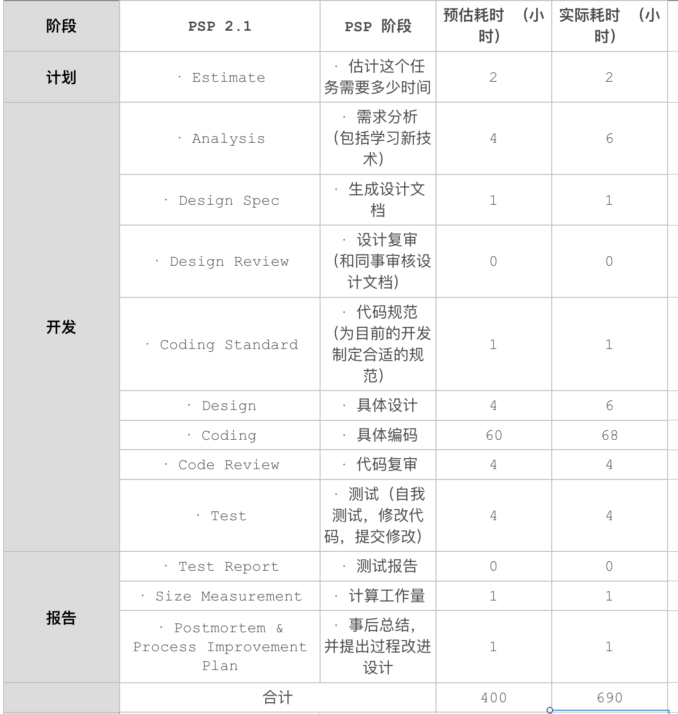
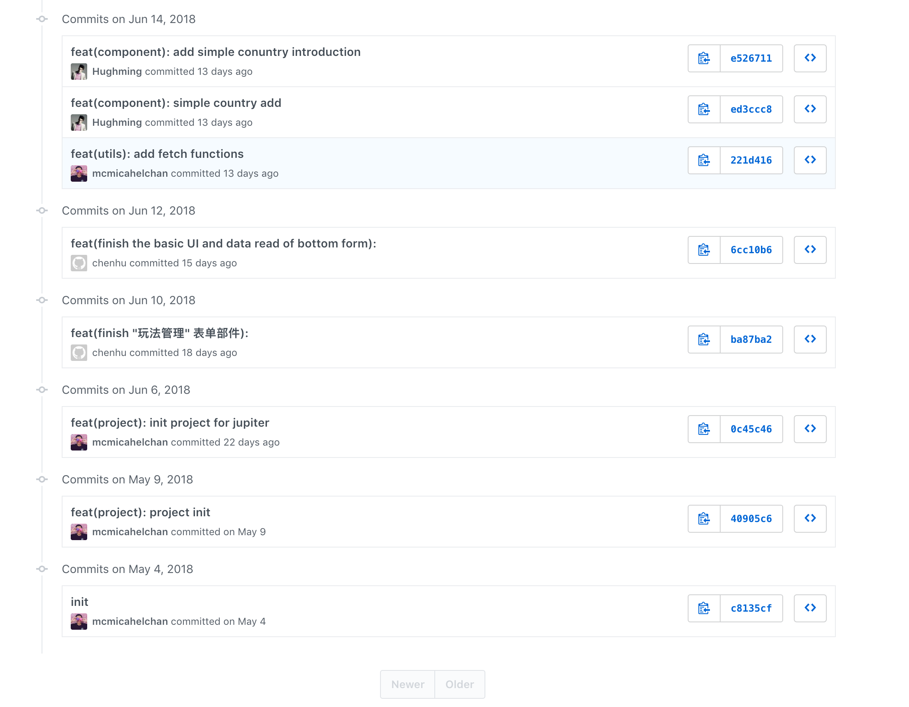
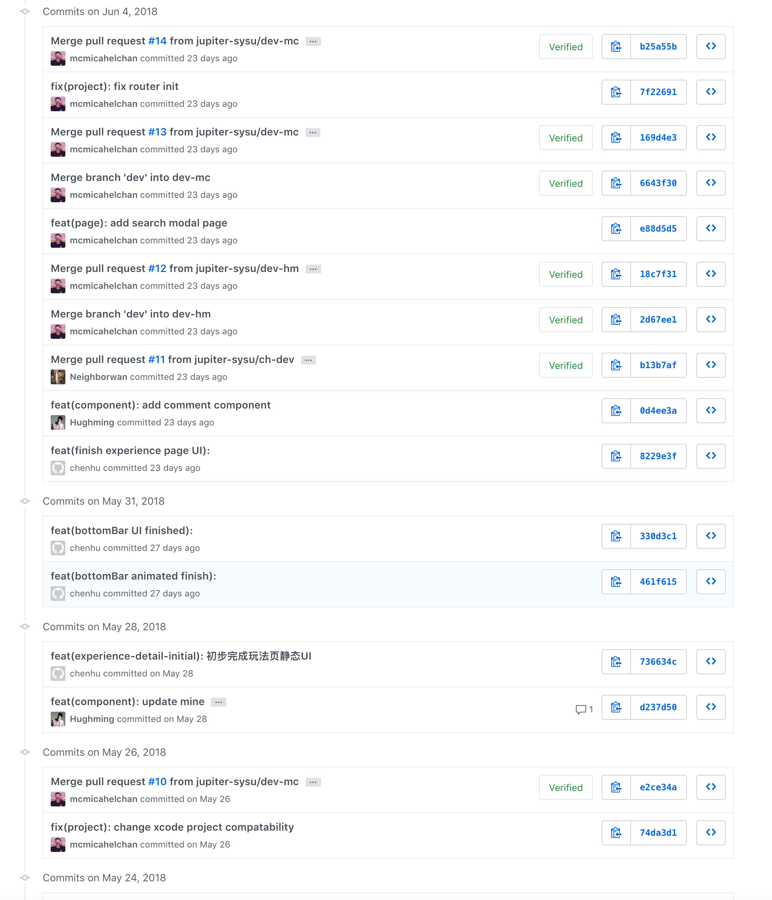
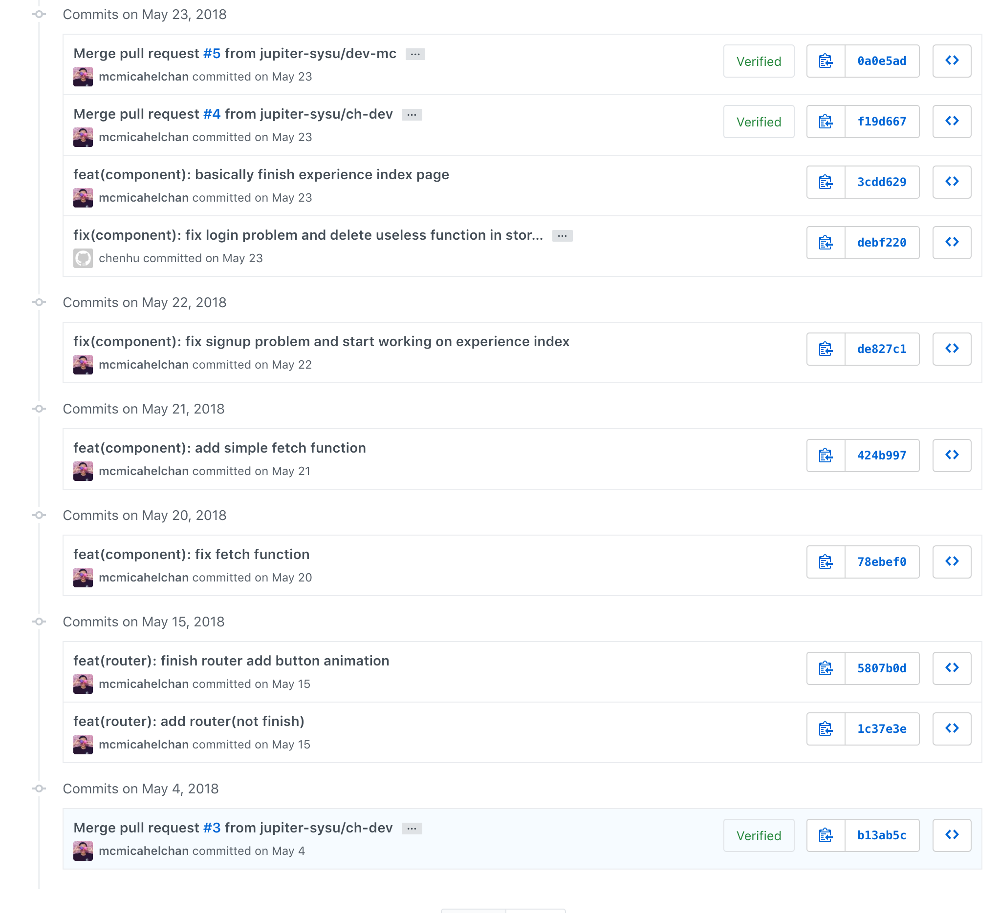
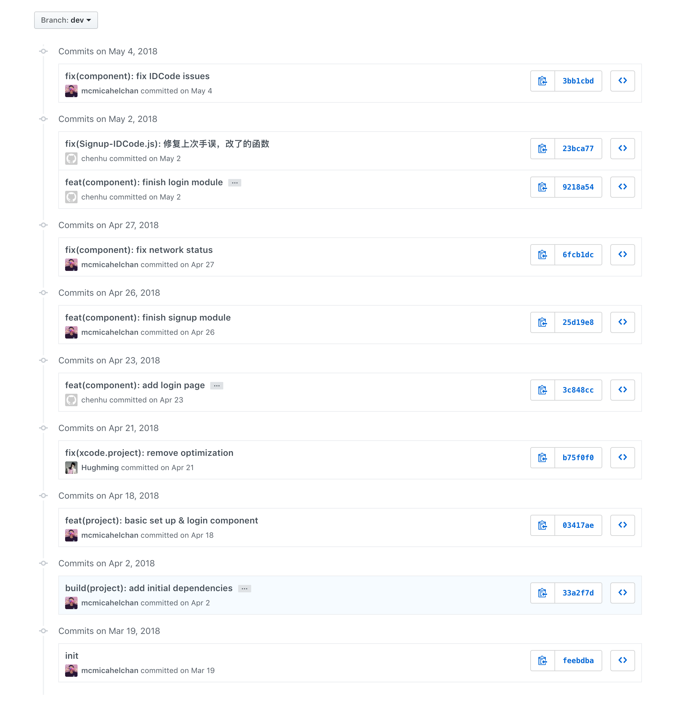

# 期末总结-15331019
{:.no_toc}

* 目录
{:toc}

#### PSP 2.1统计表

#### commit记录
所有粉红色头像～

#### 自认为最得意/或有价值/或有苦劳的工作清单
- 作为组长，带领小组迭代出一个产品的基本形态
- 作为前端组长，搭建整个项目的大框架和大设置，负责技术选型、核心组件和核心函数的编写
- 引导后端建立工作规范
- 深度参与产品的设计，以及交互设计