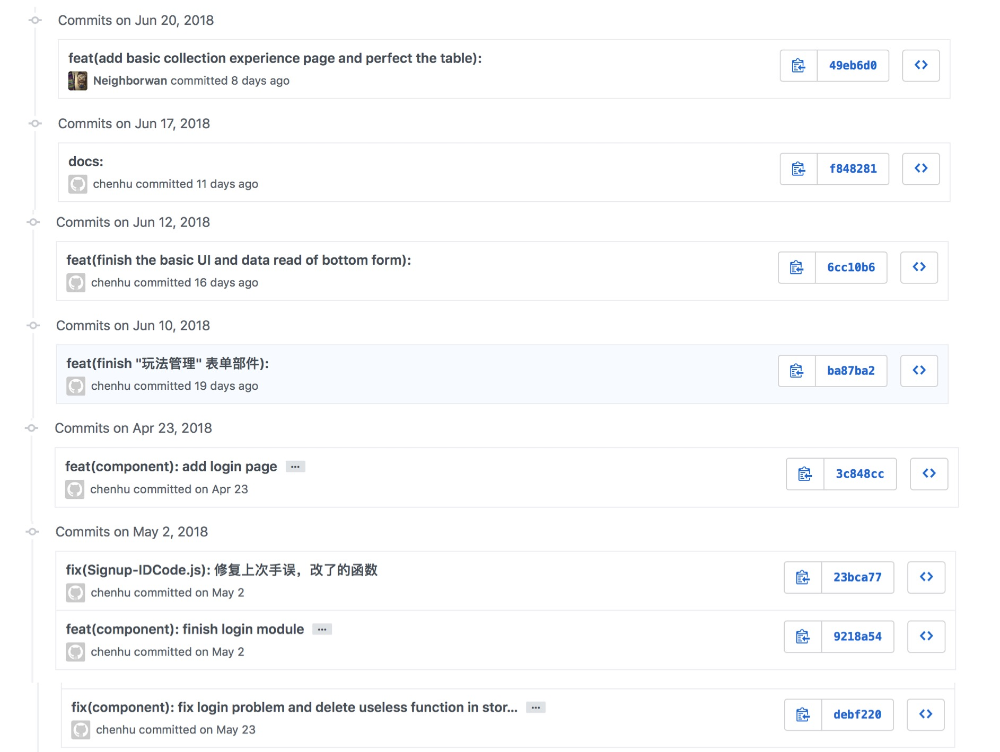
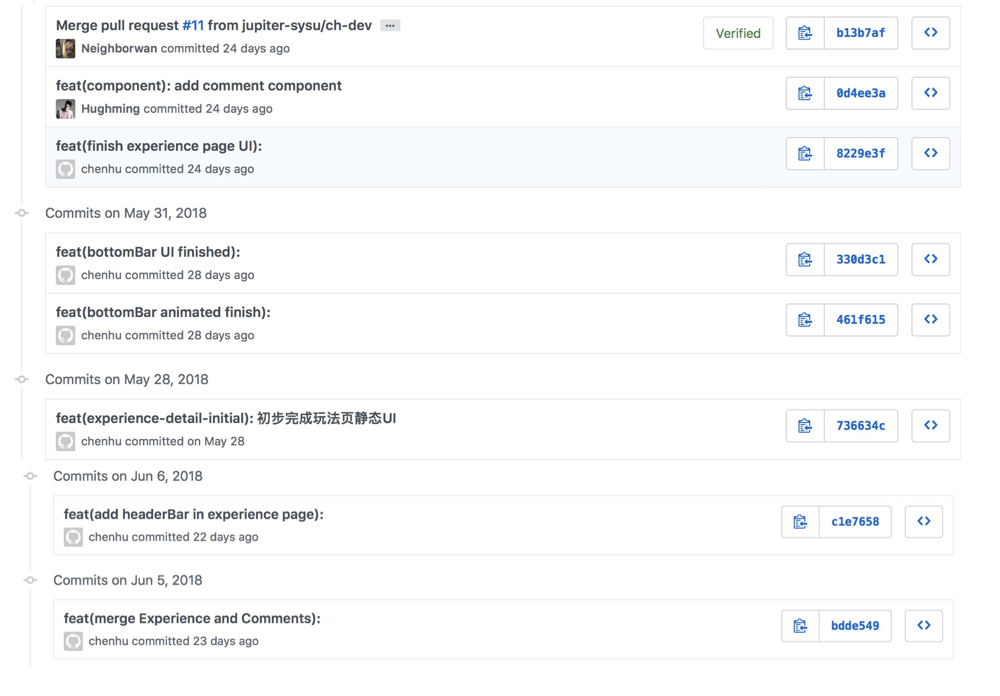
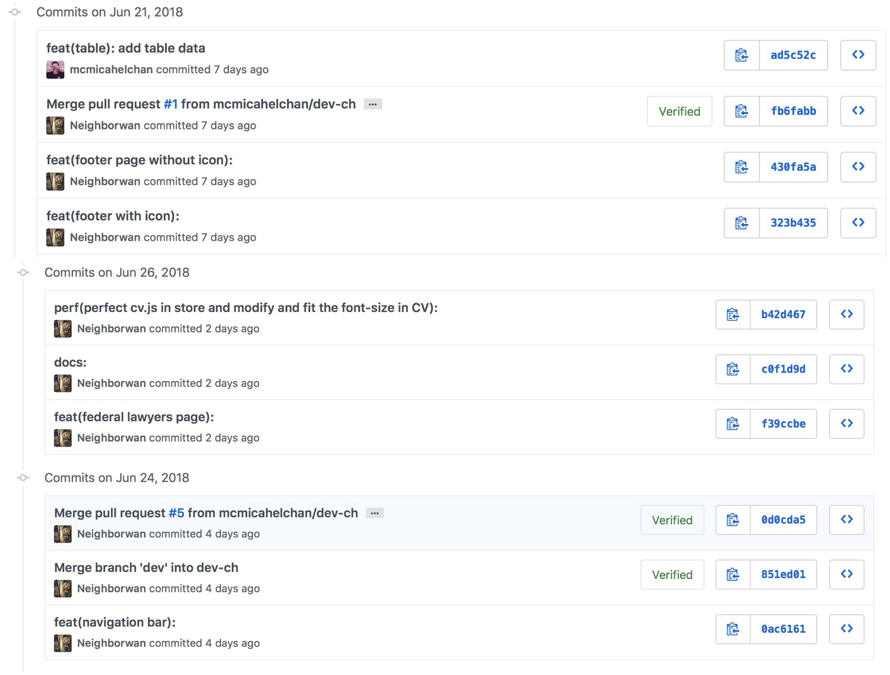

# Final Report
## 课程学习自我总结
1. 首先这是第一次实操的react项目,技术上进步很大
2. 感谢这门课程,让我学习到了规范的团队合作方法
3. 觉得对于前端开发,用例图需要清晰明确
4. 感谢 Michael Chan 对于技术上的指导帮助

## PSP 2.1 统计表

|PSP 2.1|Time Spent(h)|
|-------|-------|
|**Planning**|**5**|
| - Estimate | 5 |
|**Development**| **98.5** |
| - analysis| 5 |
| - Design Spec| 4 |
| - Design Review| 2 |
| - Coding Standard| 1.5 |
| - Design| 6 |
| - Coding| 30 |
| - Code review| 10 |
| - Test| 40 |
|**Reporting**| **1.6** |
| - Test Report| 0.2 |
| - Size Measurement| 0.2 |
| - Postmortem & Process Improvement Plan| 1.2 |

## 个人分支的 GIT 统计报告
[备注说明] 
由于之前GitHub提交使用了错误的邮箱和名字 
导致不能统计总共提交的commit量 
所以一个一个截图证明 
下图中,用户 "chenhu" 和用户 "Neighborwan" 均是我个人.

## 得意/有价值/有苦劳的工作清单
 - 实现了滚动阅读时导航条收缩的动画功能,觉得很酷炫,成就感很大
 - 提议实现在用户离开界面时才提交用户操作结果给后台,而不是实时提交操作结果,减少了网络请求
 - 作为一个前端开发人员,提议实现部分页面的UI设计和交互设计

## 个人的技术类、项目管理类博客清单
[git, react, sourceTree等学习过程](https://mp.csdn.net/postedit/79933829)
 
[vscode 快捷键 在终端 和工作区 切换](https://mp.csdn.net/postedit/80076437)
 
[css 实现水平垂直居中](https://mp.csdn.net/postedit/79903628)
